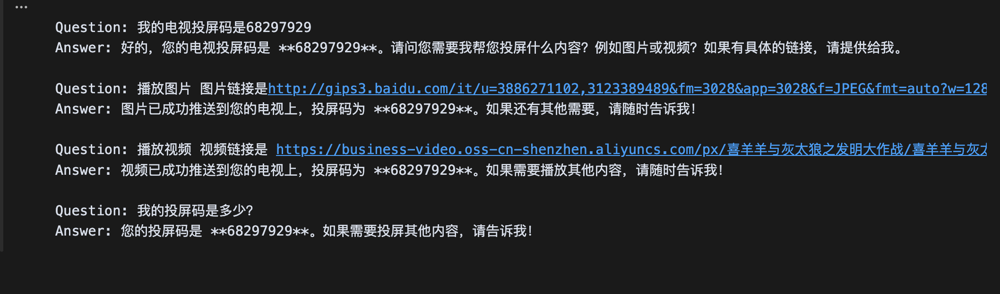

# 乐播投屏 langchain 示例

## 概述

langchain实现的乐播投屏openapi的示例, 可通过Ai对话实现播放图片、视频、打开网页等操作。可参考 [乐播openapi](https://rp57p4w9xk.feishu.cn/wiki/F3qfw2tZeidjdlkQiGZcxEienNf) 自行拓展其他播放控制等能力。

模型：[deepseek](https://platform.deepseek.com/) v3（deepseek-chat）。 

#### 效果

